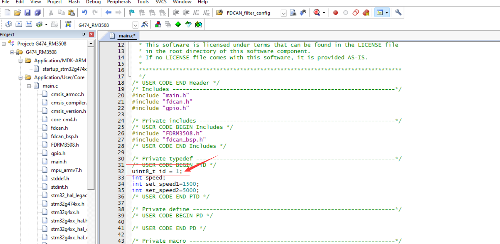
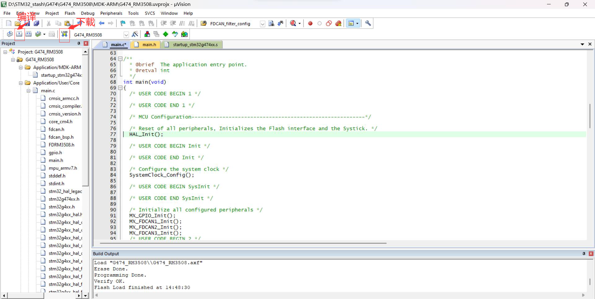
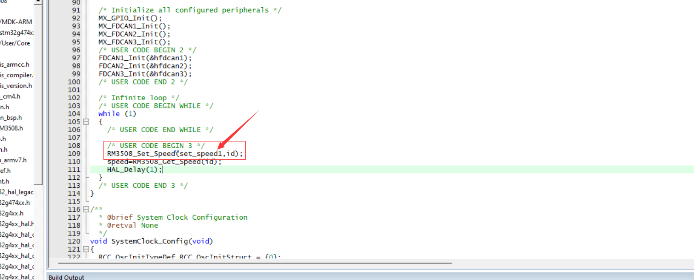

测试FDCAN,使用电机测试比较方便，三个FDCAN口都设置好了，需测哪个口就用哪个口连接can线（电调使用c620，电机使用RM3508）

第一步：打开程序后，观察电调在短时间的闪烁绿灯的次数，闪烁次数对应下图矩形中数字的值

第二步：点击编译，等待编译完成，点击下载，等待下载完成

![截图](8225d6a9f5e54aba3ffd97ff3b4fef74.png

第三步，在连接无误后，点击reset，观察电机转速

第四步，将set_speed1改为set_speed2，然后编辑下载，因为set_speed1的设置电机速度小于set_speed2的设置电机速度，观察两速度是否有比较明显的差异，如果有差异那证明can口是好的

