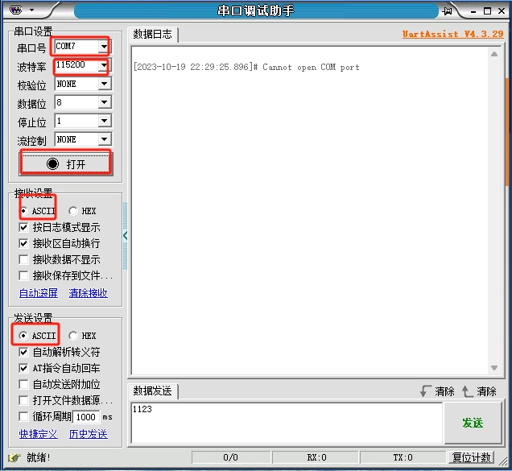

# Lpuart的test

## 1.将usb转ttl接线到板子上

### 一定要检查线接触是否良好，必要时做一个4p的接口，不然可能一直测试失败。

## 2.确保电脑中安装好串口助手，推荐XCOM，附下载链接

[https://blog.csdn.net/qq_40296728/article/details/132159837](https://)

## 3. 直接打开工程编译下载，记得按板子上的RESET复位键。

## 4.打开串口助手，配置好波特率115200和端口（端口可以拔插测试）

## 5.发送大于两位的信息，eg：“12”，“123”...

## 6.如果串口接受成功后发送了“Hi bro!This lpuart is OK!”，则lpuart测试成功