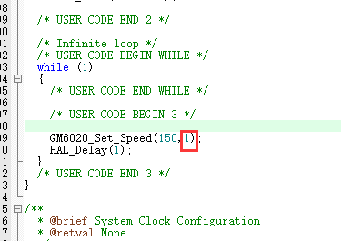
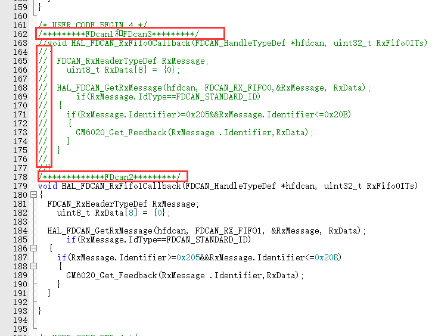
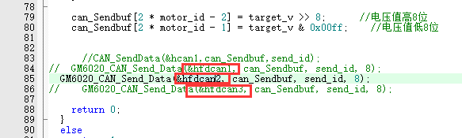

# fdcan的测试（控6020）

## 1.接线，取保6020上电并且can线接触良好（一定先检查硬件），当测试不同can时别忘了换接口。

## 2.打开工程修改一下细节

### a. 6020上电之后在电源线接口右边会闪绿灯，闪几次ID就是几，然后把main函数中while（1）里set_speed函数中的第二位改成相应id

### b.要测试fdcan1，2，3分别修改中断回调，在main函数最下面，fdcan1和3用fifo0，fdcan2用fifo1，用哪个把另一个注释掉就ok，

 

### c.在GM6020.c文件中修改参数用fdcan几就把相应的解注释掉。

## 3.编译下载，下载成功后reset。6020平放桌上即可，转速不快。
